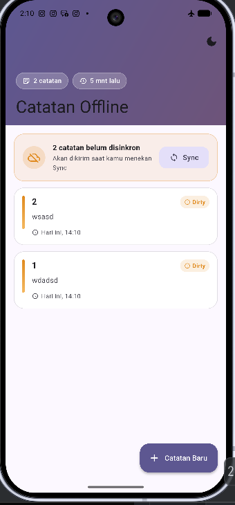
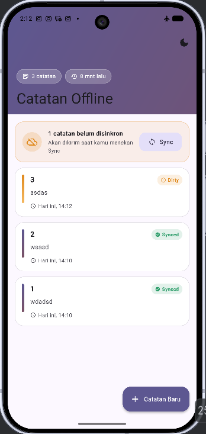
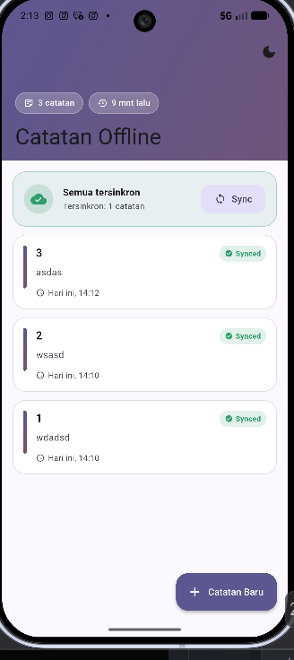
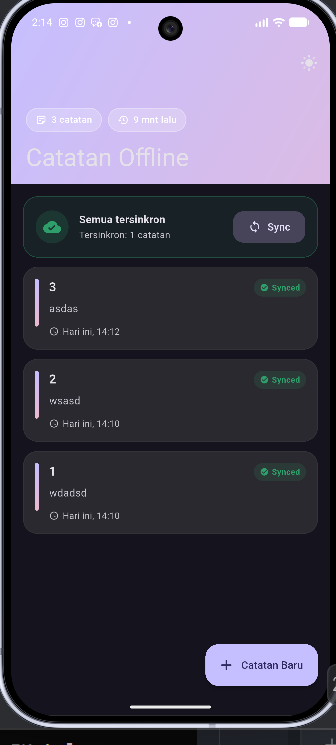

# Bukti Mode Pesawat (Airplane Mode)

Langkah pengambilan bukti agar dosen/penilai dapat memverifikasi perilaku
offline-first. Screenshot disimpan di `docs/evidence/` (buat foldernya saat
mengambil bukti).

## Prasyarat

- Aplikasi sudah dijalankan minimal sekali (agar tema & `last_opened` tersimpan).
- Buat 2–3 catatan.

## Skenario

### A. Daftar catatan saat OFFLINE

1. Aktifkan **mode pesawat** pada perangkat/emulator.
2. Buka aplikasi dan buka daftar catatan.
3. Screenshot: daftar tetap tampil lengkap (cache-first) meski tanpa jaringan.

**Bukti:**

### B. Badge dirty SEBELUM sync

1. Dalam kondisi mode pesawat, buat/edit/hapus satu catatan.
2. Perhatikan banner oranye **"N catatan belum disinkronkan (dirty)"** dan titik
   oranye pada baris catatan.
3. Screenshot.

**Bukti:**

### C. Setelah sync (badge hilang)

1. Nonaktifkan mode pesawat.
2. Tekan tombol **Sync**.
3. Banner berubah hijau **"Semua catatan tersinkron"** + ikon `check_circle`;
   pesan "Tersinkron: N catatan" muncul.
4. Screenshot.

**Bukti:**

### D. Preferensi SharedPreferences (Dark Mode & Last Opened)

1. Ganti mode tema dengan tombol di AppBar kanan atas.
2. Perhatikan banner/chip "Terakhir dibuka" dan adaptasi tema warna.
3. Screenshot.

**Bukti:**

## Ringkasan Perilaku yang Dibuktikan

| Bukti | Membuktikan |
|---|---|
| `01_offline_list.png` | Cache-first read bekerja tanpa jaringan |
| `02_dirty_before_sync.png` | Dirty flag menandai tulisan offline |
| `03_after_sync.png` | `syncNotes()` membersihkan dirty & UI ter-update |
| `04_dark_mode_prefs.png` | Persistensi tema & waktu buka terakhir (SharedPreferences) |

> Tombol Sync diimplementasikan pada `lib/ui/notes_list_page.dart` (`_SyncCard`)
> dan memanggil `NotesController.sync()`.

